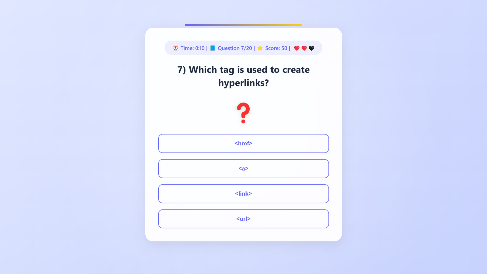

# 🏆 JavaScript Test Platform

**A fun and interactive quiz platform** to test and improve your knowledge of **HTML**, **CSS**, **JavaScript**, and more! 🎯  
Featuring **AJAX-loaded dynamic questions**, **SweetAlert2 notifications**, and a **real-time timer** for a thrilling experience! ⏳🎉



## 🚀 Features 

✔ **Multiple Categories** – Practice HTML, CSS, JS and more 📚  
✔ **Dynamic Loading** – Questions are loaded from JSON files ⚡
✔ **SweetAlert2 Feedback** – Fun and colorful notifications 🎨  
✔ **Real-time Timer** – 15 seconds per question to keep you alert ⏳  
✔ **Responsive Design** – Looks great on all devices 📱💻

---

## 🎯 How It Works

1️⃣ Open the platform and press "Start Test".  
2️⃣ A question will appear dynamically with 4 answer choices.  
3️⃣ Choose the correct answer before time runs out!  
4️⃣ 3 mistakes = Game Over 😱  
5️⃣ Complete all questions to see your final score! 🏆  

👉 Questions are loaded from `/src/json/test.json` file.

Sample question structure:
```json
{
  "quiz": "Which HTML tag is used for the largest heading?",
  "option-1": "<h1>",
  "option-2": "<h6>",
  "option-3": "<heading>",
  "option-4": "<head>"
}
```

Main Game Card:
```html
<div class="card quiz-card d-none" id="game-card">
    <h4 id="question-number" class="quiz-timer"></h4>
    <h2 id="quiz-container" class="mb-4">
        <span id="quiz-text">🔄</span>
    </h2>
    <p id="emoji" class="quiz-emoji">❓</p>
    <div id="options" class="quiz-options"></div>
</div>
```

Game Logic Snippet (JavaScript):
```javascript
document.addEventListener("DOMContentLoaded", () => {
    const gameCard = document.getElementById("game-card");
    const quizContainer = document.getElementById("quiz-text");
    const questionNumber = document.getElementById("question-number");
    const optionsContainer = document.getElementById("options");

    let lessons = [];
    let currentIndex = 0;
    let mistakeCount = 0;
    let totalScore = 0;
    let isProcessing = false;
    let timer;
    let timeLeft = 15;

    async function loadLessons() {
        try {
            const response = await fetch('./src/json/test.json');
            lessons = await response.json();
            resetGame();
            gameCard.classList.remove("d-none");
            loadQuestion();
        } catch (error) {
            console.error("Error:", error);
        }
    }

    loadLessons();

    function loadQuestion() {
        if (currentIndex >= lessons.length) {
            showResult("🎉 Excellent result!", `All questions completed! Total score: ${totalScore}`, "success", resetGame);
            return;
        }

        const currentLesson = lessons[currentIndex];
        // Load question and options dynamically...
    }
});
```

---

## 📂 Project Structure

```
/project-root
│── /src/css/style.css        # Styling
│── /src/json/test.json       # Questions list
│── /src/images/banner.png    # Banner image
│── index.html                # Main UI
│── README.md                 # Documentation
```

---

## 🔧 Setup & Installation

1️⃣ **Clone the repository:**  
```bash
git clone https://github.com/Iqbolshoh/javascript-test-platform.git
```

2️⃣ **Navigate to the project directory:**  
```bash
cd javascript-test-platform
```

3️⃣ **Open `index.html` in your browser and start playing!** 🚀  

---

## 🖥 Technologies Used


## 📜 License
This project is open-source and available under the **MIT License**.

## 🤝 Contributing  
🎯 Contributions are welcome! If you have suggestions or want to enhance the project, feel free to fork the repository and submit a pull request.

## 📬 Connect with Me  
💬 I love meeting new people and discussing tech, business, and creative ideas. Let’s connect! You can reach me on these platforms:

<div align="center">
  <table>
    <tr>
      <td>
        <a href="https://iqbolshoh.uz" target="_blank">
          
        </a>
      </td>
      <td>
        <a href="mailto:iilhomjonov777@gmail.com" target="_blank">
          
        </a>
      </td>
      <td>
        <a href="https://github.com/iqbolshoh" target="_blank">
          
        </a>
      </td>
      <td>
        <a href="https://www.linkedin.com/in/iqbolshoh/" target="_blank">
          
        </a>
      </td>
      <td>
        <a href="https://t.me/iqbolshoh_777" target="_blank">
          
        </a>
      </td>
      <td>
        <a href="https://wa.me/998997799333" target="_blank">
          
        </a>
      </td>
      <td>
        <a href="https://instagram.com/iqbolshoh_777" target="_blank">
          
        </a>
      </td>
      <td>
        <a href="https://x.com/iqbolshoh_777" target="_blank">
          
        </a>
      </td>
      <td>
        <a href="https://www.youtube.com/@Iqbolshoh_777" target="_blank">
          
        </a>
      </td>
    </tr>
  </table>
</div>
